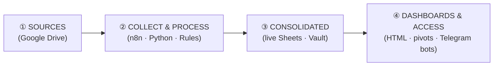

# 🏗️ Compliance Data Pipeline — Architecture

The wiki is the **control panel** for one pipeline across GST, Income Tax and Salary:

**① Sources → ② Collect & Process → ③ Consolidated data → ④ Dashboards & access.**

Each layer below is a *registry* — the single place that lists what exists, where it lives, and
what feeds what. Keep these tables current; they are the map of the whole system.

---

## ① Data Sources (raw, in Google Drive)

| Domain | Source | Drive ID / location |
|---|---|---|
| GST | GST notice tracker (AK Dash, live master) | `1ySb1_B2z7YOjMchvn8lxZWNqpuqbprK5` · vault `_attachments/GST_notice_tracker_AKDash_2026-07-17.xlsx` |
| GST | Challans, audit workings, reply docs | folder `IMPRESSIONS SERVICES GST NOTICE TRACKER` (`1HK5dBud0squvbw_xYCDwEmk5w7Jo3dkW`) |
| Income Tax | IT notice extracts (FY22-23, 17-18) | `1sqnPX5Xj5jRugh2TI2FjcHXE0ZCVFHsZ` · `1Hj1-sGWIsF23R8mqOngxXzKYkNV5AV0W` |
| Salary | Monthly salary sheets + ECR PF + Future-ESI | see `docs/SALARY_KNOWLEDGEBASE.md` §3 |
| Salary | CONSOL RevisedBlock (rebuilt, full year) | `CONSOL_FY202526_RevisedBlock_REBUILT.xlsx` `1x9jqCsNrXnfwLMGulbhKl784hi81UiLA` |

## ② Collect & Process

| Kind | What | ID / location |
|---|---|---|
| n8n | Convert xlsx→Google Sheet, SUMIFS/COUNTIFS pivots, PF tie-out | workflow `yW982OvlLUmfwAQ0` (+ PF `aNN8KbvSRlrXdm6W`) |
| n8n | Restore/repair consol rows | `cEVdcP9W3K2aO5Ra` |
| Python | PF/ESI reconciliation | `reconcile.py` (Drive) · repo `docs/pf-salary-reconciliation/build.py` |
| Rules | The processing logic that governs it all | [[pf-ecr-case-rules]] · [[wage-code-50pct-rule]] · [[net-payable-sacrosanct]] · [[m13-annual-trueup]] · [[pf-contribution-basis]] |

## ③ Consolidated Data (single source of truth)

| Domain | Consolidated store | Location |
|---|---|---|
| Salary | Live linked pivot workbook | `PIVOT_FY202526_LIVE_LINKED` (`1tVwkaZPVZ9PMEkY952z6ZAQGL8UVuLUpSSC8HdymjFM`) → [[2026-07-pivot-consol-live-linked]] |
| GST | 34-case consolidated tracker | [[2026-07-gst-notice-tracker]] |
| Income Tax | Consolidated notices | [[2026-01-income-tax-ay2023-24-survey-search]] · [[income-tax-ay2015-to-2019-reassessment]] |
| All | **The vault** — tagged, linked, point-in-time index | this repo `vault/` |

## ④ Dashboards & Access

| Channel | What | ID / location |
|---|---|---|
| HTML | Salary FY25-26 dashboard | `docs/pf-salary-reconciliation/dashboard.html` |
| Sheet | Live pivot tabs (month / state / PF tie-out) | inside `PIVOT_FY202526_LIVE_LINKED` |
| Telegram | GST / IT / Salary query bots | [[telegram-query-bots]] |
| Obsidian | Graph view + MOCs | [[index]] · [[MOC-Salary]] · [[MOC-GST]] · [[MOC-Income-Tax]] |

---

## What's missing (the build roadmap)

The pipeline exists but the **④ dashboard layer is domain-siloed** (salary HTML, GST xlsx dashboard,
no IT dashboard). The capstone is a **unified dashboard generator**:

1. **Consolidate** — one processing step that reads all three ③ stores.
2. **Generate** — emit a single self-contained `COMPLIANCE_DASHBOARD.html` (GST exposure, IT
   proposed additions, salary/PF/ESI liabilities, upcoming due dates) — one page, always current.
3. **Refresh** — one-shot n8n run (or scheduled) that regenerates it into Drive + vault.

> Next step candidates: (a) build the unified dashboard generator; (b) add a data-source
> auto-registry that lists new Drive files into ① automatically; (c) extend the IT bot to
> live-read like the GST bot. See chat for sequencing.
