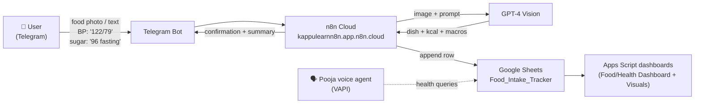
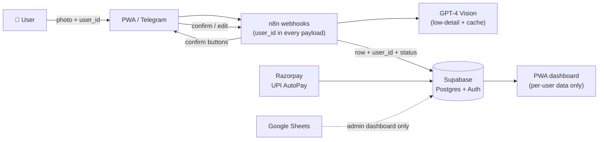

# Architecture

## v1 — today (single user, live)



**Components**

| Component | Role | Notes |
|---|---|---|
| Telegram Bot API | User channel | Free, unlimited — structural cost advantage vs WhatsApp Business API |
| n8n Cloud | Orchestration layer | All flows are n8n workflows; also the ops layer (error alert emails) |
| GPT-4 Vision | Dish identification + estimation | **Must run low-detail mode + dish-cache** — see cost warning in [Business Plan](Business-Plan.md) |
| Google Sheets | Storage + dashboards (v1) | `Food_Intake_Tracker` — see [Food Intake Tracker](Food-Intake-Tracker.md) |
| Apps Script | Builds 4 dark-theme dashboard sheets | `buildDashboard()` — script preserved in the HEALTHSNAP_SKILL doc on Drive |
| VAPI ("Pooja") | Voice Q&A over user's data | Family-plan feature |
| Netlify | Hosts landing page / PWA | `webapp/` in this repo is the new build |

## v2 — commercial multi-user (next build)



**The five minimal n8n changes for multi-user** (from the commercial spec):

1. Add `user_id` to every webhook payload
2. Replace "Write to Google Sheet" node → "Write to Supabase" node
3. Add Telegram **inline keyboard** node for the confirm step
4. Add callback-handler node for button responses
5. Add filter node so dashboard queries return only the requesting user's records

**Why Supabase over Sheets:** Sheets is personal and breaks at ~50 users; Supabase rows carry `user_id`, scale to 10k+ users, and auth (phone/Google) is built in. The Sheet survives as an admin dashboard.

**Supabase tables (planned):** `users`, `food_logs (user_id, dish_name, kcal, macros, status, timestamp)`, `bp_logs`, `glucose_logs`, `corrections` (the AI-improvement stream).

## Entry status model (used everywhere: DB, dashboard, Telegram)

| Status | Color | Meaning |
|---|---|---|
| User confirmed | 🟢 Green | 100% accurate |
| User corrected | 🔵 Blue | Accurate — AI was wrong, correction stored for learning |
| AI estimated | 🟡 Yellow | Auto-saved after 1h no-response, flagged approximate |
| Pending | 🟠 Orange | Awaiting user attention |

## The confirmation loop (critical design)

```
Photo uploaded
   ↓
AI result shown (10-sec window in app)
   ├── User confirms → save immediately (green)
   └── No response → Telegram inline buttons [✅ Save] [✏️ Edit] [❌ Wrong]
         ├── Confirms in Telegram → save
         └── Still nothing after 1 hour → auto-save flagged "AI estimated" (yellow)
```

This loop is the product's trust moat: wrong guesses never silently pollute data, and corrections continuously improve Indian-dish accuracy.
